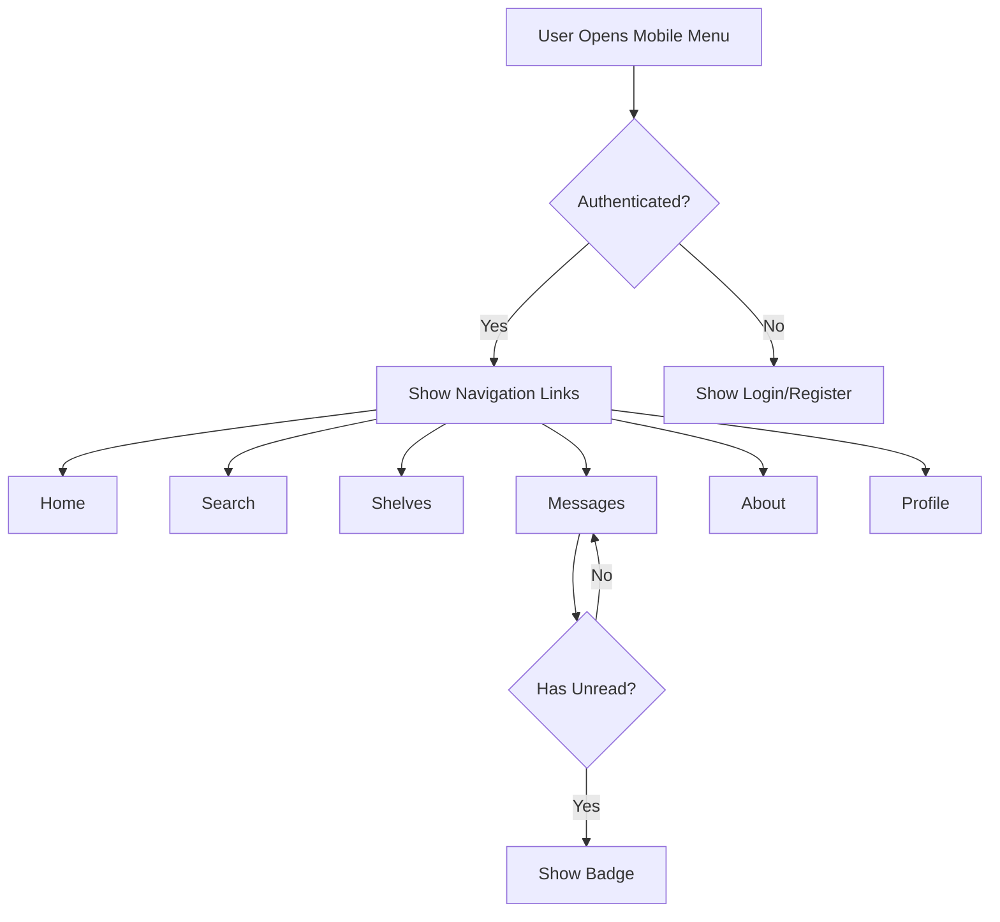
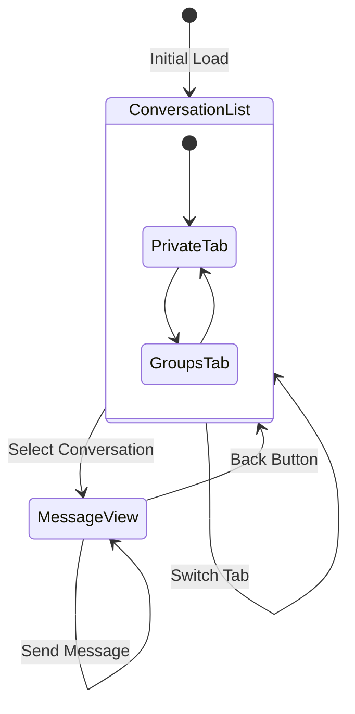
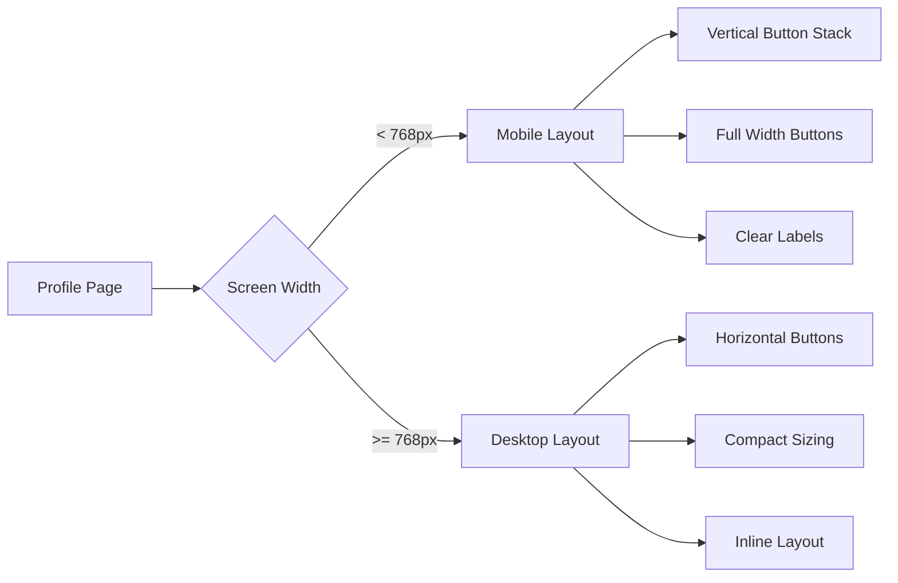
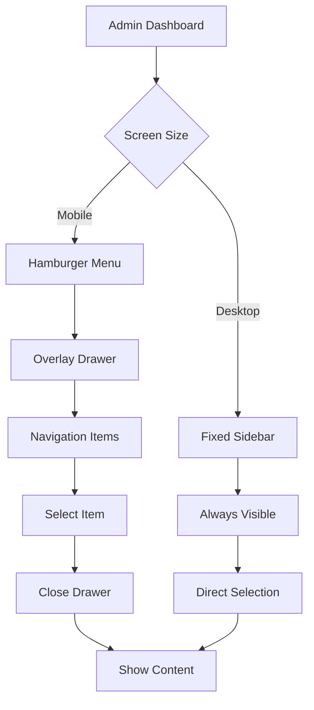

# Mobile Menu and Responsive UI Enhancements

## Overview

This design addresses multiple mobile responsiveness issues across the Reader.Market application, focusing on improving navigation, layout adaptability, and user experience on mobile devices.

## Problem Statement

The current mobile implementation has several usability issues:

1. **Missing Messages Link**: The mobile menu lacks a "Messages" navigation item, preventing mobile users from accessing the messaging feature
2. **Profile Page Button Visibility**: Profile action buttons (Upload Avatar, Edit Profile, Share Profile, Logout) are not properly visible or accessible on mobile screens
3. **Messages Page Layout**: The messaging interface does not adapt well to mobile screens - the conversation list and message display compete for space
4. **Admin Dashboard Navigation**: The admin sidebar menu does not fit properly on mobile screens
5. **Shelves Page Button Labels**: Two "+" buttons on the Shelves page are unclear - their purpose is not evident on mobile devices where text labels are hidden

## Proposed Solutions

### 1. Add Messages Link to Mobile Menu

**Objective**: Provide mobile users with access to the messaging feature

**Approach**:
- Add a new menu item in MobileMenu component for Messages
- Include unread message count badge for notifications
- Use consistent icon (MessageCircle) matching desktop navigation
- Follow existing pattern of other menu items

**Component Changes**:
- File: `client/src/components/MobileMenu.tsx`
- Add Messages link between Shelves and About links
- Implement unread count fetching similar to desktop Navbar
- Include appropriate icon and translation key

### 2. Responsive Profile Page Action Buttons

**Objective**: Make all profile management actions accessible on mobile devices

**Current Issue**: 
- Buttons arranged horizontally overflow on small screens
- Button text causes width issues
- Multiple buttons compete for limited space

**Solution Strategy**:
The profile action buttons should adapt based on screen size:

**Mobile Layout** (screens < 768px):
- Stack buttons vertically in a centered column
- Full-width buttons for better touch targets
- Clear, visible text labels
- Appropriate spacing between buttons

**Tablet/Desktop Layout** (screens ≥ 768px):
- Horizontal arrangement (current behavior)
- Compact button sizing
- Inline layout

**Button Organization**:
- Group related actions logically
- Primary actions (avatar, profile edit) more prominent
- Secondary actions (share, logout) clearly accessible
- Conditional rendering based on profile ownership

### 3. Adaptive Messages Page Layout

**Objective**: Create a mobile-first messaging experience that doesn't compromise functionality

**Current Problem**:
- Conversation list and message display shown side-by-side
- Both panels compete for horizontal space
- Poor usability on mobile screens

**Solution Architecture**:

The Messages page should implement a view-switching pattern for mobile:

**Mobile View** (screens < 768px):
- **Default State**: Show only conversation/group list
- **Selected State**: Show only message display
- Navigation between views via:
  - Back button in message header to return to list
  - Conversation selection triggers view switch
  - Smooth transition animations

**Desktop View** (screens ≥ 768px):
- Current side-by-side layout maintained
- Conversation list on left
- Messages on right
- No view switching needed

**Implementation Pattern**:
- Use conditional rendering based on screen width
- State management for active view on mobile
- Preserve desktop layout unchanged
- Handle deep linking appropriately

### 4. Responsive Admin Dashboard Navigation

**Objective**: Make admin dashboard fully functional on mobile devices

**Current Issue**:
- Fixed-width sidebar (256px) doesn't adapt
- Menu items may be cut off or force horizontal scroll
- Poor mobile navigation experience

**Solution Approaches**:

**Option A: Collapsible Sidebar (Recommended)**
- Sidebar hidden by default on mobile
- Hamburger menu button in header toggles visibility
- Overlay sidebar slides in from left
- Backdrop dismisses sidebar when tapped
- Desktop behavior unchanged

**Option B: Bottom Navigation**
- Tab bar at bottom on mobile
- Icon-based navigation with labels
- Scrollable if many items
- Desktop retains sidebar

**Recommendation**: Option A (Collapsible Sidebar)
- More familiar pattern
- Preserves desktop experience
- Works well with existing UI library
- Sheet component already available

**Implementation Strategy**:
- Add mobile menu state management
- Implement Sheet/Drawer component for mobile
- Preserve existing navigation structure
- Maintain current desktop layout
- Handle viewport detection

### 5. Clear Shelves Page Button Labeling

**Objective**: Make button purposes clear on all screen sizes

**Current Problem**:
- Two "+" buttons appear without context on mobile
- Text labels hidden with `hidden sm:inline`
- Users cannot distinguish between:
  - Add New Book button
  - Add New Shelf button

**Solution Strategy**:

**Visual Differentiation**:
- Use distinct icons for each action:
  - **New Book**: BookOpen or BookPlus icon
  - **New Shelf**: Library or FolderPlus icon
- Maintain "+" icon but add context

**Mobile-Specific Labels**:
Instead of hiding text completely, use:
- Tooltip/title attributes for hover states
- Always show abbreviated labels on mobile
- Responsive button text:
  - Mobile: "Book" / "Shelf"
  - Desktop: "New Book" / "New Shelf"

**Alternative Mobile Layout**:
- Stack buttons vertically on very small screens
- Full-width buttons with complete labels
- Better touch targets
- Clear visual hierarchy

**Recommended Approach**:
- Change icons to be more descriptive
- Show abbreviated text on mobile (not hidden)
- Larger touch targets
- Consider icon + text layout

## Technical Specifications

### Breakpoint Strategy

Use consistent breakpoints across all components:

| Breakpoint | Width | Usage |
|------------|-------|-------|
| Mobile | < 768px | Vertical layouts, stacked elements |
| Tablet | 768px - 1023px | Transitional layouts |
| Desktop | ≥ 1024px | Full horizontal layouts |

### Component Patterns

**Responsive Visibility**:
- Use existing `useIsMobile()` hook
- Conditional rendering based on viewport
- Maintain single source of truth for breakpoints

**Layout Adaptation**:
- CSS classes for responsive behavior
- Flexbox column/row switching
- Grid system adjustments
- Appropriate padding/spacing

**Navigation State**:
- Manage mobile menu open/closed state
- Preserve scroll position
- Handle back navigation
- Clear state on viewport resize

### Icon Usage Consistency

Follow project convention from memory:
- Use consistent icon set across features
- Match existing navigation patterns
- Lucide React icons preferred

### Translation Support

All new UI text must support internationalization:
- Use translation keys for all labels
- Update both English and Russian locales
- Follow existing translation structure
- Keys should be descriptive and namespaced

### Accessibility Considerations

**Mobile Navigation**:
- Adequate touch target sizes (minimum 44x44px)
- Clear focus indicators
- Screen reader labels
- Keyboard navigation support

**Visual Feedback**:
- Active states clearly visible
- Loading states for async actions
- Error messaging
- Success confirmations

**Gestures**:
- Standard swipe gestures where appropriate
- No custom gestures requiring explanation
- Fallback to tap interactions

## Implementation Phases

### Phase 1: Critical Navigation Issues
**Priority: High**
- Add Messages link to mobile menu
- Implement mobile profile button layout
- Update translation files

### Phase 2: Layout Adaptations
**Priority: High**
- Implement responsive Messages page
- Create mobile admin navigation
- Test on various devices

### Phase 3: UI Refinements
**Priority: Medium**
- Clarify Shelves page buttons
- Polish transitions and animations
- Comprehensive testing

## Testing Requirements

### Device Testing

Test on multiple devices and screen sizes:
- Small phones (320px - 375px width)
- Standard phones (375px - 414px width)
- Large phones (414px - 480px width)
- Tablets (768px - 1024px width)
- Desktop (> 1024px width)

### Orientation Testing

Verify both orientations:
- Portrait mode
- Landscape mode
- Rotation transitions

### Functional Testing

**Mobile Menu**:
- All links navigate correctly
- Menu opens and closes smoothly
- Active states work
- Unread counts update

**Profile Page**:
- All buttons accessible
- Button actions work correctly
- Responsive layout adapts
- No content cutoff

**Messages Page**:
- View switching works smoothly
- Conversations load correctly
- Messages send successfully
- Back navigation functions
- Deep links work

**Admin Dashboard**:
- Navigation accessible
- All sections reachable
- Content displays properly
- Forms submit correctly

**Shelves Page**:
- Button purposes clear
- Actions work correctly
- Touch targets adequate
- Labels visible

### Browser Testing

Test across browsers:
- Chrome/Edge (Chromium)
- Safari (iOS and macOS)
- Firefox
- Samsung Internet

## Design Decisions and Rationale

### Why Mobile-First for Messages Page

The view-switching pattern for messaging is chosen because:
- Conversation list and messages both need full attention
- Split view on mobile creates cramped experience
- Common pattern users understand (WhatsApp, Telegram)
- Maintains desktop experience without compromise
- Simpler state management

### Why Collapsible Sidebar for Admin

Collapsible sidebar is preferred over bottom navigation because:
- Admin dashboard has many navigation items
- Bottom bar would be crowded or require scrolling
- Desktop sidebar pattern is familiar
- Easier to implement with existing components
- Professional appearance maintained

### Button Labeling Philosophy

Always showing some text is important because:
- Icons alone can be ambiguous
- Accessibility for screen readers
- Reduced cognitive load
- Better user confidence
- Consistency with material design principles

## Dependencies

### Existing Components
- Sheet component (for mobile menus)
- Button component (with variants)
- Dialog component (for modals)
- Badge component (for unread counts)

### Hooks
- `useIsMobile()` - viewport detection
- `useAuth()` - user authentication state
- `useTranslation()` - internationalization

### External Libraries
- wouter - routing
- lucide-react - icons
- react-i18next - translations

## Mermaid Diagrams

### Mobile Menu Flow

### Messages Page Mobile State

### Responsive Profile Layout

### Admin Dashboard Navigation

## Edge Cases and Considerations

### Profile Button Overflow
- If user has many buttons (future features), consider dropdown menu
- Scrollable button area as fallback
- Prioritize most common actions

### Messages Deep Linking
- URL with conversation ID should open directly to conversation on mobile
- Implement smooth transition from list to message view
- Handle invalid conversation IDs gracefully

### Admin Dashboard Content
- Long data tables need horizontal scroll
- Forms should stack fields vertically
- Charts should resize appropriately
- Consider separate mobile optimized admin views for complex operations

### Shelves Page Button Count
- Currently two buttons, may grow
- Consider action menu pattern if more than 3 buttons
- Floating action button as alternative pattern

### Viewport Resize Handling
- User rotates device mid-interaction
- Window resized on desktop
- Maintain user's context and state
- Smooth transitions between layouts

## Success Metrics

The implementation will be considered successful when:

1. **Mobile menu includes Messages** - users can navigate to messaging from mobile
2. **Profile buttons fully accessible** - all actions work on mobile devices
3. **Messages page usable on mobile** - users can read and send messages easily
4. **Admin dashboard functional** - moderators can perform all tasks on mobile
5. **Shelves buttons clearly labeled** - no user confusion about button purposes
6. **No horizontal scroll** - all content fits viewport width on mobile
7. **Touch targets adequate** - all interactive elements easily tappable
8. **Performance maintained** - responsive behavior doesn't degrade load times

## Notes for Implementation

- Preserve existing desktop functionality completely
- Test at each breakpoint, not just extremes
- Consider touch vs mouse interaction patterns
- Implement progressive enhancement approach
- Maintain accessibility throughout
- Update relevant tests
- Document new responsive patterns for future features
