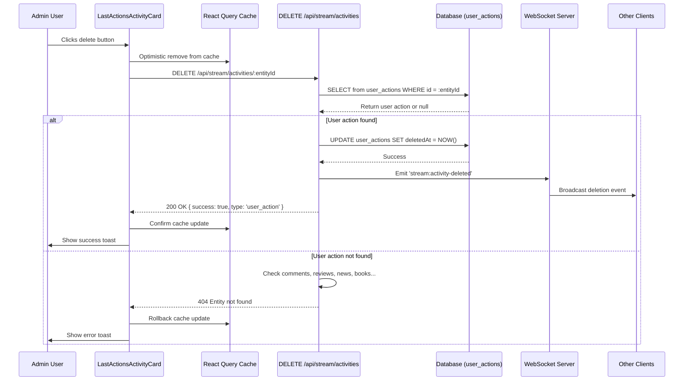
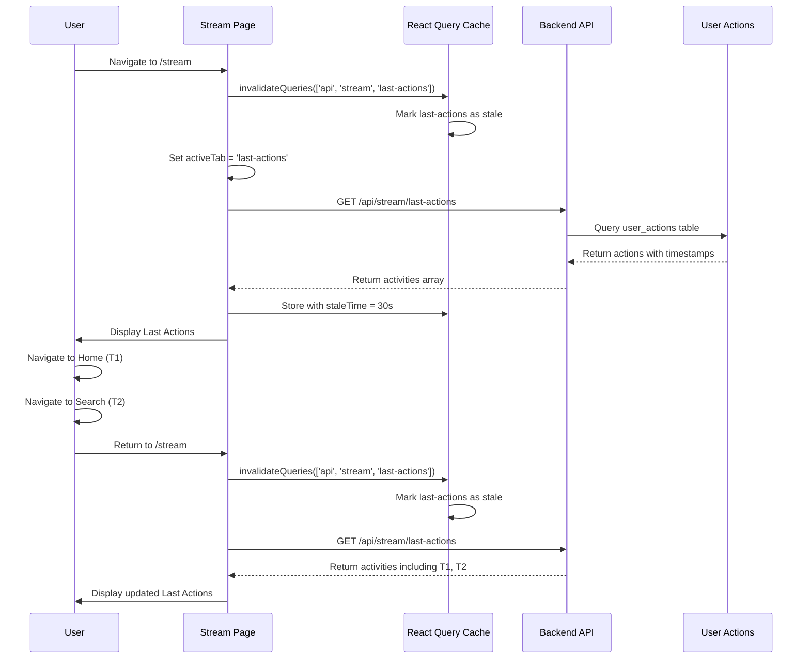

# Design Document: Stream Last Actions Tab Issues

## Problem Statement

Two critical issues have been identified with the Last Actions tab on the `/stream` page:

### Issue 1: User Actions Cannot Be Deleted

Administrators and moderators cannot delete activities on the `/stream` page when viewing the "Last Actions" tab. While deletion works correctly for other activity types (news, comments, reviews, books) on other tabs, it fails for user action entries displayed in the Last Actions tab.

### Issue 2: Stale Data After Navigation

When users navigate from the Last Actions tab to other pages (Home, Search, My Shelves) and then return to the Last Actions tab, their new navigation actions are not visible. The cached data is not refreshed, causing the tab to display outdated information that doesn't reflect the user's recent activities.

## Issue 1: User Action Deletion Failure

### Current Implementation Analysis

### Frontend Implementation

The `LastActionsActivityCard` component correctly implements the delete button:
- Checks user permissions (admin or moderator)
- Calls the delete API endpoint: `DELETE /api/stream/activities/${activity.entityId}`
- Performs optimistic UI update by removing the activity from the React Query cache
- Displays appropriate success/error toast notifications

### Backend Implementation Gap

The backend endpoint `DELETE /api/stream/activities/:entityId` has a critical gap:

**Current Logic Flow:**
1. Checks if entityId is a comment → deletes if found
2. Checks if entityId is a review → deletes if found  
3. Checks if entityId is a news item → deletes if found
4. Checks if entityId is a book → deletes if found
5. **Returns 404 "Entity not found" if none of the above**

**Missing:** The endpoint does not check for or handle `user_action` type activities from the `user_actions` table.

### Data Model Context

The Last Actions tab displays a merged stream containing two types of entries:

| Entry Source | Type Value | Source Table | Entity ID Field |
|--------------|-----------|--------------|-----------------|
| Global activities | `news`, `book`, `comment`, `review` | `activity_feed` | `entityId` (references source table) |
| User actions | `user_action` | `user_actions` | `id` (primary key) |

When a user action is rendered in `LastActionsActivityCard`, the `entityId` property contains the `user_actions.id` value, not a reference to another table.

### Root Cause

The deletion endpoint fails to recognize user actions as valid deletable entities. When the backend tries to find the `entityId` in comments, reviews, news, or books tables, it fails because the ID belongs to the `user_actions` table instead.

### Design Solution for Issue 1

#### Backend Changes

**1. Extend DELETE Endpoint Logic**

Update the `DELETE /api/stream/activities/:entityId` endpoint in `server/routes.ts` to include user action handling:

**New Logic Flow:**
1. Check if entityId exists in `comments` table → delete if found
2. Check if entityId exists in `reviews` table → delete if found
3. Check if entityId exists in `news` table → delete if found
4. Check if entityId exists in `books` table → delete if found
5. **NEW: Check if entityId exists in `user_actions` table → delete if found**
6. Return 404 only if not found in any table

**Implementation Details:**
- Query `user_actions` table by ID
- Perform soft delete by setting `deletedAt` timestamp
- Broadcast deletion event via WebSocket to `stream:global` room and `stream:last-actions` room
- Return success response with type: 'user_action'

**2. Add Storage Method for User Action Deletion**

Add new method to `server/storage.ts`:

**Method Signature:**
```
deleteUserAction(id: string): Promise<boolean>
```

**Behavior:**
- Accept user action ID as parameter
- Update the `user_actions` record to set `deletedAt = NOW()`
- Return true if deletion successful, false if record not found
- No user ownership check required (admin/moderator only endpoint)

**Database Operation:**
- Soft delete: UPDATE user_actions SET deletedAt = NOW() WHERE id = :id AND deletedAt IS NULL
- Preserve data integrity: deleted records remain in database but excluded from queries

#### WebSocket Broadcast Enhancement

The deletion broadcast should be sent to both rooms:
- `stream:global` - for consistency with other deletion events
- `stream:last-actions` - specifically for Last Actions tab listeners

**Event Structure:**
```
Event: 'stream:activity-deleted'
Payload: { entityId: string }
```

#### Frontend Cache Update

The existing optimistic update in `LastActionsActivityCard` is correct but incomplete:

**Current:** Only updates `['api', 'stream', 'last-actions']` cache

**Enhancement Needed:** Also update global cache to maintain consistency across tabs:
- `['api', 'stream', 'global']` - may contain user actions
- `['api', 'stream', 'personal']` - may contain user's own actions
- `['api', 'stream', 'shelves']` - less likely but possible

## Issue 2: Stale Last Actions Data

### Current Implementation Analysis

**React Query Configuration:**
The Last Actions query uses the following configuration:

```typescript
const { data: lastActionsData, refetch: refetchLastActions } = useQuery({
  queryKey: ['api', 'stream', 'last-actions'],
  queryFn: async () => { /* fetch logic */ },
  enabled: activeTab === 'last-actions',
});
```

**Key Observations:**

1. **Conditional Fetching:** The query is only enabled when `activeTab === 'last-actions'`
2. **Cache Persistence:** React Query caches the data indefinitely by default
3. **No Invalidation on Mount:** The component's mount effect (lines 57-76) only invalidates global, personal, and shelves caches - not last-actions
4. **WebSocket Updates:** Real-time updates work correctly via `stream:last-action` event handler
5. **Tab Visibility Refetch:** Works when returning to browser tab, but not when navigating within the app

### User Experience Flow

**Scenario:**
1. User opens Stream page → navigates to Last Actions tab
2. Data loads and is cached with timestamp T1
3. User clicks "Home" (navigation action recorded at T2)
4. User clicks "Search" (navigation action recorded at T3)
5. User clicks "Stream" link → returns to Last Actions tab
6. **Problem:** Data from T1 is still displayed, missing actions from T2 and T3

**Why It Happens:**
- The query is disabled when user leaves Last Actions tab
- When user returns, React Query serves stale cached data
- The mount effect doesn't invalidate last-actions cache
- WebSocket events are only received while on the Stream page

### Root Cause

The Last Actions tab lacks a cache invalidation strategy for when users return to the Stream page after navigating away. Unlike other tabs, the last-actions cache is not invalidated on component mount, causing stale data to persist.

### Design Solution for Issue 2

#### Solution Approach Analysis

**Option A: Invalidate on Mount**
- Pros: Simple, ensures fresh data on every visit
- Cons: May cause unnecessary network requests
- Implementation: Add last-actions to mount effect invalidation

**Option B: Invalidate on Tab Change**
- Pros: Only refetches when switching to Last Actions tab
- Cons: Adds complexity to tab change handler
- Implementation: Detect when activeTab changes to 'last-actions'

**Option C: Short Cache Time**
- Pros: React Query handles staleness automatically
- Cons: May refetch too frequently
- Implementation: Set `staleTime: 30000` (30 seconds)

**Option D: Refetch on Window Focus**
- Pros: Handles browser tab switching and app navigation
- Cons: May miss in-app navigation without focus change
- Implementation: Use `refetchOnWindowFocus: true`

**Recommended Solution: Hybrid Approach (A + C)**

Combine mount invalidation with reasonable stale time:
- Invalidate last-actions cache on component mount
- Set staleTime to 30 seconds to prevent excessive refetching
- Keep existing WebSocket real-time updates
- Maintain tab visibility refetch behavior

#### Frontend Changes

**1. Add Last Actions to Mount Invalidation**

Update the mount effect in `StreamPage.tsx` (lines 57-76):

```typescript
useEffect(() => {
  console.log('[STREAM PAGE] Component mounted, invalidating cache for fresh data');
  
  // Always invalidate global stream
  queryClient.invalidateQueries({ queryKey: ['api', 'stream', 'global'] });
  
  // NEW: Always invalidate last actions to show recent navigation
  queryClient.invalidateQueries({ queryKey: ['api', 'stream', 'last-actions'] });
  
  // Conditional invalidations for other tabs...
}, []);
```

**2. Configure Query Stale Time**

Update the last-actions query configuration:

```typescript
const { data: lastActionsData, refetch: refetchLastActions } = useQuery({
  queryKey: ['api', 'stream', 'last-actions'],
  queryFn: async () => { /* existing fetch logic */ },
  enabled: activeTab === 'last-actions',
  staleTime: 30000, // Consider data stale after 30 seconds
  refetchOnWindowFocus: true, // Refetch when user returns to browser tab
});
```

**Benefits:**
- Data refreshes every time user enters Stream page
- Prevents excessive refetching within 30-second window
- Handles both browser tab switching and in-app navigation
- Maintains existing real-time update functionality

**Alternative: Refetch on Tab Change**

If mount invalidation proves too aggressive, implement tab-change detection:

```typescript
useEffect(() => {
  // Refetch last actions when switching to that tab
  if (activeTab === 'last-actions') {
    console.log('[STREAM PAGE] Switched to Last Actions, refetching...');
    refetchLastActions();
  }
}, [activeTab]);
```

## Combined Implementation Checklist

### Issue 1: Backend Tasks (User Action Deletion)

1. **Storage Layer** - Add user action deletion method
   - Create `deleteUserAction(id: string)` method in `DBStorage` class
   - Implement soft delete using `deletedAt` timestamp
   - Add method to `IStorage` interface for type safety

2. **API Endpoint** - Extend deletion handler
   - Add user action check before returning 404
   - Query `user_actions` table by entityId
   - Call `storage.deleteUserAction()` if found
   - Broadcast deletion to both WebSocket rooms

3. **WebSocket** - Enhance broadcast coverage
   - Emit to `stream:last-actions` room in addition to `stream:global`
   - Ensure consistent event payload structure

### Issue 1: Frontend Tasks (User Action Deletion)

1. **Cache Management** - Extend optimistic update
   - Update all relevant query caches when deleting user action
   - Handle both `user_action` type and standard activity types
   - Maintain cache consistency across tabs

2. **Error Handling** - Improve user feedback
   - Distinguish between permission errors and not-found errors
   - Provide specific error messages for debugging

### Issue 2: Frontend Tasks (Stale Data Fix)

1. **Mount Effect Update**
   - Add last-actions to cache invalidation list
   - Verify logging shows cache invalidation on mount
   - Test that data refreshes when returning to Stream page

2. **Query Configuration**
   - Add staleTime: 30000 to last-actions query
   - Add refetchOnWindowFocus: true
   - Verify query behavior in React Query DevTools

3. **Performance Testing**
   - Monitor network requests in browser DevTools
   - Ensure no excessive refetching (respect staleTime)
   - Verify WebSocket updates still work

### Combined Testing Requirements

#### Issue 1: Deletion Testing

1. **Permission Testing**
   - Verify delete button only visible to admin/moderator users
   - Verify endpoint rejects non-admin requests with 403

2. **Functional Testing**
   - Delete user action on Last Actions tab → should disappear from UI
   - Check other tabs → deleted action should not appear
   - Verify WebSocket broadcast received by other connected clients
   - Verify database record has `deletedAt` timestamp set

3. **Edge Cases**
   - Attempt to delete already-deleted user action → should return 404
   - Attempt to delete non-existent ID → should return 404
   - Simultaneous deletion attempts → should handle gracefully

#### Issue 2: Cache Refresh Testing

1. **Navigation Flow Testing**
   - Navigate to Last Actions → see initial data
   - Navigate to Home (creates action T1)
   - Navigate to Search (creates action T2)  
   - Return to Stream → Last Actions should show T1 and T2
   - Verify no duplicates or stale entries

2. **Cache Behavior Testing**
   - Open Stream → Last Actions tab loads
   - Wait 20 seconds, switch tabs within Stream
   - Return to Last Actions → should not refetch (within staleTime)
   - Wait 40 seconds, switch tabs
   - Return to Last Actions → should refetch (exceeded staleTime)

3. **WebSocket Integration Testing**
   - Open Stream → Last Actions tab
   - Create navigation action from another browser tab
   - Verify real-time update appears without refresh
   - Ensure mount invalidation doesn't interfere with WebSocket updates

4. **Browser Tab Focus Testing**
   - Navigate to Last Actions tab
   - Switch to different browser tab for 5 minutes
   - Return to browser tab
   - Verify data refetches via refetchOnWindowFocus

## Data Flow Diagrams

### Issue 1: User Action Deletion Flow



### Issue 2: Cache Refresh Flow



## Combined Security Considerations

### Issue 1: Deletion Security
- **Authorization:** Endpoint protected by `requireAdminOrModerator` middleware
- **Soft Delete:** Maintains data integrity and audit trail
- **No Cascade:** Deleting user action does not affect related entities
- **Permissions Check:** No additional checks needed as user actions are system-generated

### Issue 2: Cache Security
- **No New Attack Vectors:** Cache invalidation is client-side only
- **Data Freshness:** Ensures users see their own recent actions
- **Privacy:** No cross-user data leakage (queries are user-specific)
- **Rate Limiting:** StaleTime prevents excessive API requests

## Combined Performance Impact

### Issue 1: Deletion Performance
- **Minimal:** Single additional database query (SELECT from user_actions)
- **Query Optimization:** Add index on `user_actions.id` if not exists (likely already indexed as primary key)
- **Cache Impact:** Standard optimistic update pattern, no additional overhead

### Issue 2: Cache Refresh Performance
- **Additional Requests:** One extra API call on Stream page mount
- **Mitigation:** 30-second staleTime prevents excessive refetching
- **Network Impact:** ~1-5KB response size for typical last-actions payload
- **User Experience:** Imperceptible delay, data appears fresh instantly from cache
- **Optimization:** Consider increasing staleTime to 60s if mount refetch proves too frequent

## Future Enhancements

### Issue 1: Deletion Enhancements
1. **Bulk Deletion:** Support deleting multiple user actions at once
2. **Undo Mechanism:** Allow admins to restore recently deleted actions
3. **Audit Logging:** Track who deleted which actions and when
4. **Filtering Options:** Add ability to bulk-delete actions by type or date range

### Issue 2: Cache Strategy Enhancements
1. **Smart Invalidation:** Only invalidate when user performed actions outside Stream page
2. **Background Sync:** Use background refetch instead of invalidation for smoother UX
3. **Incremental Updates:** Fetch only new actions since last timestamp
4. **Optimistic Navigation Logging:** Show navigation action immediately in cache before API confirmation

## Success Criteria

### Issue 1: Deletion Success Criteria

1. Admin/moderator can click delete button on user action cards in Last Actions tab
2. User action disappears from UI immediately (optimistic update)
3. Backend successfully soft-deletes record in `user_actions` table
4. WebSocket broadcast notifies all connected clients
5. Deleted action does not reappear after page refresh
6. Error handling provides clear feedback for edge cases

### Issue 2: Cache Refresh Success Criteria

1. User navigates from Last Actions to other pages and back
2. New navigation actions appear in Last Actions tab immediately
3. No duplicate entries appear in the list
4. Data remains fresh without excessive API calls (respects staleTime)
5. WebSocket real-time updates continue to work
6. Browser tab switching triggers appropriate refetch
7. No performance degradation or noticeable lag

## Confidence Assessment

**Overall Confidence Level:** High

### Issue 1 Confidence: High
**Reasoning:**
- Clear identification of root cause (missing user_actions handling)
- Straightforward solution following existing deletion patterns
- Similar deletion logic already implemented for other entity types
- Low risk of side effects due to soft delete approach
- Existing WebSocket infrastructure supports required broadcasts

### Issue 2 Confidence: High
**Reasoning:**
- Problem clearly understood (cache not invalidated on mount)
- Solution uses standard React Query patterns
- Similar invalidation logic already exists for other tabs
- Minimal code changes required
- StaleTime configuration prevents performance issues
- Well-tested pattern in React Query ecosystem

**Risk Mitigation:**
- Start with conservative staleTime (30s) and adjust based on usage patterns
- Monitor API request frequency in production
- Consider feature flag to enable/disable mount invalidation if issues arise
