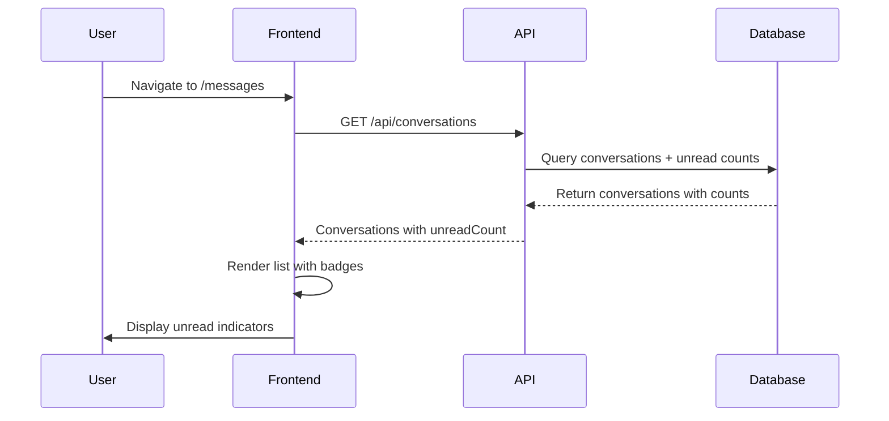
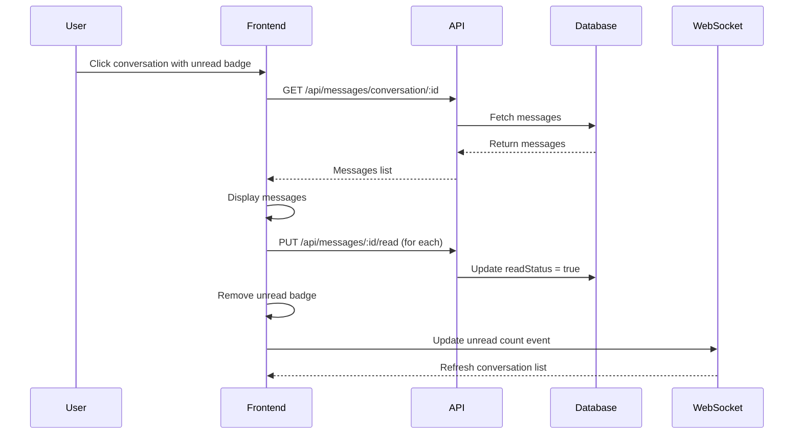
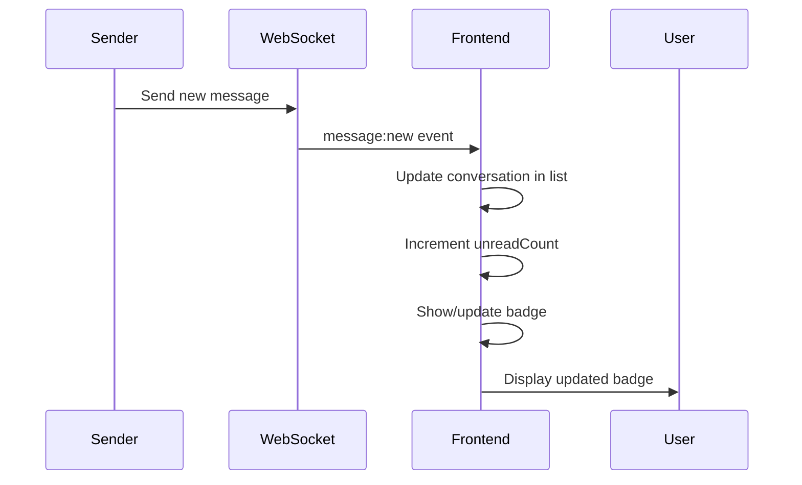

# Unread Message Indicator Design

## Overview

Add visual indicators to the conversation and group list on the Messages page to show which chats contain unread messages. This will help users quickly identify conversations that need their attention.

## Background

Currently, the Messages page (`/messages`) displays a list of private conversations and groups, but there is no visual indication of which chats have unread messages. Users must click through each conversation to discover new messages. The backend already tracks message read status through the `readStatus` field in the messages table, but this information is not surfaced in the UI conversation list.

## Objectives

- Provide immediate visual feedback about unread messages in the conversation list
- Help users prioritize which conversations require attention
- Maintain consistency with existing unread count indicator in the navbar
- Ensure real-time updates when messages are read or received

## Target Users

All authenticated users who use the messaging system to communicate with other users or participate in group discussions.

## Scope

### In Scope

- Visual indicator for unread messages in private conversation list items
- Visual indicator for unread messages in group list items
- Backend API enhancement to provide unread count per conversation
- Backend API enhancement to provide unread count per group
- Real-time updates when messages are marked as read
- Real-time updates when new messages arrive

### Out of Scope

- Per-channel unread indicators within groups
- Mark all as read functionality
- Notification settings or preferences
- Message preview enhancements
- Desktop or push notifications

## Requirements

### Functional Requirements

#### FR-1: Display Unread Count for Private Conversations
Each conversation item in the private conversations list must display the number of unread messages when there are one or more unread messages from the other user.

#### FR-2: Display Unread Count for Groups
Each group item in the groups list must display the total number of unread messages across all channels in that group.

#### FR-3: Visual Indicator Styling
The unread count indicator must be clearly visible and distinguishable, typically displayed as a badge or pill with contrasting colors.

#### FR-4: Clear Indicator on Read
When a user opens a conversation or group channel, the unread indicator must disappear after all messages are marked as read.

#### FR-5: Real-time Updates via WebSocket
The unread indicators must update in real-time when new messages arrive or when messages are marked as read, without requiring a page refresh.

### Non-Functional Requirements

#### NFR-1: Performance
Fetching unread counts should not significantly impact the loading time of the conversation list. Consider including unread counts in the existing conversation list API response rather than making separate requests.

#### NFR-2: Visual Consistency
The unread indicator design should be consistent with the existing unread count badge in the navbar component.

#### NFR-3: Accessibility
The unread count should be readable with sufficient color contrast and should be announced by screen readers.

## Design Approach

### Data Model

The existing database schema already supports tracking read status:

**messages table:**
- `readStatus`: boolean field indicating whether a message has been read
- `recipientId`: identifies the recipient for private messages
- `conversationId`: links to the conversation
- `channelId`: links to group channels

No database schema changes are required.

### API Enhancement Strategy

#### Option A: Extend Existing Conversation List API
Modify the `GET /api/conversations` endpoint to include an `unreadCount` field for each conversation in the response.

**Advantages:**
- Single API call to fetch conversations and unread counts
- Better performance with reduced network requests
- Simpler client-side logic

**Disadvantages:**
- Requires backend changes to conversation list query
- Slightly more complex SQL query with aggregation

#### Option B: Separate Unread Count API per Conversation
Create endpoint `GET /api/conversations/:conversationId/unread-count` and call it for each conversation.

**Advantages:**
- Minimal changes to existing API
- Granular control over fetching unread counts

**Disadvantages:**
- Multiple API calls (N+1 problem)
- Poor performance for users with many conversations
- Increased network overhead

**Decision: Use Option A** - Extend the existing conversation list API to include unread counts, as it provides better performance and user experience.

### Conversation List API Enhancement

Modify `GET /api/conversations` to return:

```
[
  {
    id: string,
    otherUser: {
      id: string,
      username: string,
      fullName: string | null,
      avatarUrl: string | null
    },
    lastMessage: {
      content: string,
      createdAt: string
    } | null,
    updatedAt: string,
    unreadCount: number  // NEW FIELD
  }
]
```

The `unreadCount` represents the number of unread messages in that conversation where the current user is the recipient.

### Group List API Enhancement

Modify `GET /api/groups` to return:

```
[
  {
    id: string,
    name: string,
    description: string | null,
    privacy: 'public' | 'private',
    memberCount: number,
    createdAt: string,
    unreadCount: number  // NEW FIELD
  }
]
```

The `unreadCount` represents the total number of unread messages across all channels in the group. For groups, tracking individual user read status is more complex and may require:
- A separate read receipts table per user per channel message
- OR a simpler approach: track the last viewed message timestamp per user per channel

**Decision:** For the initial implementation, groups will show a simplified unread indicator based on new messages since the user last viewed that group's channels. This may be implemented in a future iteration with proper read tracking per channel.

### Frontend Component Changes

Update the `Messages.tsx` component:

#### Conversation Interface
Add `unreadCount` field to the existing `Conversation` interface.

#### State Management
The existing `conversations` and `groups` state arrays will include the new `unreadCount` field.

#### UI Rendering - Private Conversations

For each conversation item in the list, display an unread count badge when `unreadCount > 0`:

- Position the badge on the right side of the conversation item
- Use a circular or pill-shaped badge with the count number
- Apply contrasting colors (e.g., primary color background with white text)
- Hide the badge when `unreadCount === 0`

#### UI Rendering - Groups

For each group item in the list, display an unread count badge when `unreadCount > 0`:

- Position the badge on the right side of the group item
- Use the same visual style as private conversation badges
- Hide the badge when `unreadCount === 0`

#### Real-time Updates

Leverage existing WebSocket event handlers:

- When `message:new` event is received, increment the unread count for the relevant conversation
- When a conversation is opened, trigger `fetchConversations()` to refresh counts
- When `markMessageAsRead()` is called, trigger count refresh
- Consider optimistic UI updates for better perceived performance

### Visual Design

#### Badge Styling

```
Style specification:
- Shape: Circle or pill (rounded)
- Background: Primary theme color or accent color (e.g., blue #3b82f6)
- Text: White color for contrast
- Font size: Small (0.75rem or 12px)
- Font weight: Medium or bold
- Padding: 2-4px horizontal, 1-2px vertical
- Minimum width: Ensure single-digit numbers are centered
- Maximum display: Show actual count up to 99, show "99+" for higher counts
- Position: Absolute or flex-positioned to the right of the conversation/group name
```

#### Layout Considerations

The conversation list item already has this structure:

```
[Avatar] [Name + Last Message Preview] [Optional Badge]
```

Add the unread badge to the right side, aligned vertically with the name or slightly below.

### Backend Query Strategy

For fetching conversations with unread counts, the backend will execute a query similar to:

**Conceptual SQL approach:**
1. Fetch all conversations for the current user
2. For each conversation, count messages where:
   - `recipientId = currentUserId`
   - `readStatus = false`
   - `conversationId = conversation.id`
3. Include this count in the response

This can be achieved using a LEFT JOIN with aggregation or separate subqueries.

For groups, the approach is more complex:
1. Fetch all groups the user is a member of
2. For each group, count messages in all channels where:
   - Messages are newer than the user's last view timestamp
   - OR use a more sophisticated read tracking mechanism

## User Flow

### Flow 1: User Views Conversation List with Unread Messages



### Flow 2: User Opens Conversation and Reads Messages



### Flow 3: User Receives New Message While Viewing List



## Edge Cases and Considerations

### Edge Case 1: Multiple Unread Messages in Same Conversation
The badge should show the total count, not individual message indicators.

### Edge Case 2: User Has Conversation Open in Another Tab
When messages are marked as read in one tab, the unread count should update in all tabs via WebSocket events or custom events.

### Edge Case 3: Very High Unread Count
Display "99+" for counts over 99 to prevent layout issues.

### Edge Case 4: Group Unread Tracking Complexity
Initial implementation may use a simplified approach for groups. Future enhancement could track read status per channel per user.

### Edge Case 5: Message Deleted Before Reading
If an unread message is deleted, the unread count should decrement accordingly.

## Accessibility Considerations

- The unread count badge should have `aria-label` describing the number of unread messages
- Use sufficient color contrast ratio (WCAG AA minimum 4.5:1)
- Ensure keyboard navigation still works properly with the badge present
- Screen readers should announce "X unread messages" when focusing on a conversation item

## Testing Strategy

### Manual Testing Scenarios

1. Verify unread badge appears when receiving a new message
2. Verify unread badge disappears when opening and viewing messages
3. Verify unread count updates in real-time via WebSocket
4. Verify badge displays correctly for counts 1-99 and 99+
5. Verify group unread indicators function properly
6. Verify visual consistency across different screen sizes
7. Test with screen reader to ensure proper announcements

### Automated Testing Considerations

- Unit tests for unread count calculation logic in backend
- Integration tests for conversation list API with unread counts
- Frontend component tests for badge rendering
- E2E tests for real-time unread count updates

## Implementation Phases

### Phase 1: Backend API Enhancement
- Modify conversation list query to include unread counts
- Update API response type definitions
- Test query performance with large datasets

### Phase 2: Frontend UI Implementation
- Update Conversation interface with unreadCount field
- Add badge component to conversation list items
- Style badge according to design specifications
- Test responsive behavior

### Phase 3: Real-time Updates
- Integrate unread count updates with existing WebSocket handlers
- Add optimistic UI updates for better responsiveness
- Test real-time synchronization across scenarios

### Phase 4: Groups Support
- Implement simplified unread tracking for groups
- Add badge to group list items
- Test group unread indicators

### Phase 5: Polish and Accessibility
- Accessibility audit and fixes
- Cross-browser testing
- Performance optimization if needed
- User acceptance testing

## Success Metrics

- Users can quickly identify conversations with unread messages
- Unread indicators update in real-time without page refresh
- No significant performance degradation in conversation list loading
- Positive user feedback on the feature usability
- Reduced time to discover new messages

## Future Enhancements

- Per-channel unread indicators within groups
- "Mark all as read" button for conversations
- Different visual styles for mentions vs regular messages
- Unread message preview in hover tooltip
- Customizable notification preferences
- Desktop notifications integration
- Badge animation when new messages arrive
